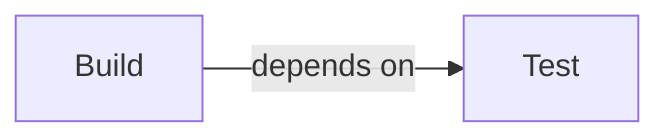
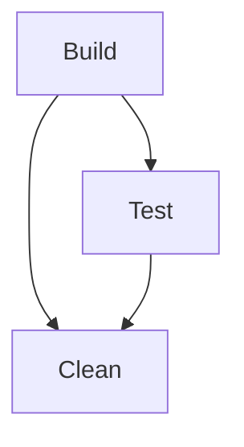
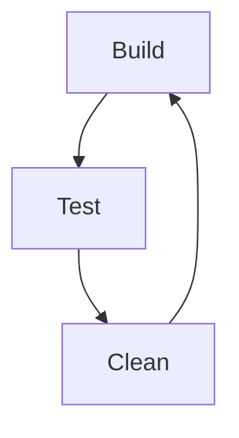

# Tutorial

The tutorial aims to introduce you to August by writing a build script for a Rust project.
In the same directory as your `Cargo.toml`, create a file called `main.august`.

## Writing a Unit

August build scripts consist of units which specify a set of commands to run.
To create a unit that prints your `Cargo.toml` and builds your crate, add the following:
```august
unit Build {
    print_file("Cargo.toml")
    exec(cargo build)
}
```
Commands such as `print_file` can usually be categorised under a namespace.
Therefore, it is possible to replace this line with it's fully qualified variant:
```august
    fs::print_file("Cargo.toml")
```
Some commands have aliases such as `exec` which can be rewritten as:
```august
    ~(cargo build)
```

Let's also create a task to run some tests:
```august
unit Test {
    ~(cargo fmt)
    ~(cargo clippy)
    ~(cargo test) 
}
```

## Dependencies

One of the advantages of a task-based build system is that a unit can be dependent on another.
In this case, `Test` must be run before `Build`.
As such, it can be said that `Build` *depends* on `Test`.
This can be described in graph format:

To communicate this to August, we can use the `depends_on` command:
```august hl_lines="2"
unit Build {
    depends_on(Test)

    print_file("Cargo.toml")
    exec(cargo build)
}
```
Something that should be noted is that `depends_on` can be placed anywhere in the unit,
and if multiple `depends_on` commands are found, their contents will be aggregated.

`depends_on` defines the key rule that powers all build systems,
a unit should only be run after all of the units it depends on have also been run.

## More Complex Dependencies

Consider the following build script:
```august hl_lines="16-18"
unit Build {
    depends_on(Test, Clean)

    print_file("Cargo.toml")
    ~(cargo build)
}

unit Test {
    depends_on(Clean)    

    ~(cargo fmt)
    ~(cargo clippy)
    ~(cargo test) 
}

unit Clean {
    ~(cargo clean)
}
```
It can be represented with the following dependency graph:

When executing `Build`, August will try to resolve both of its dependencies at once.
As such, `Test` starts it has wait for `Clean` to complete, but does not ever launch `Clean`.
This is because units have the property that will only get executed as a dependency, once per run.

For those with a familiarity of how a breadth-first search looks, its basically the same thing.

An illegal construction would look like this:

This is circular dependency and is impossible to resolve as `Build` gets blocked on `Test`
which is blocked on `Clean` which is blocked on `Build` which is blocked on `Test`!
August's decision in this case is just to deadlock and pray you ++ctrl+c++ it.

In future, verification measures may be introduced when reading the script to detect these.

## Reusablity

To return to our original example, let's talk about DRY build scripts.
August makes it possible call units sequentially as if they were commands thanks to `do`.
The following example may feel a bit contrived, but it exists to demonstrate this use case.
```august hl_lines="9 13-16"
unit Build {
    depends_on(Test)

    print_file("Cargo.toml")
    ~(cargo build)
}

unit Test {
    do(Other)
    ~(cargo test) 
}

unit Other {
    ~(cargo fmt)
    ~(cargo clippy)
}
```

`do` allows a unit to be run multiple times.
Generally, units intended to be run via `do` should not have any dependencies,
as they are meant to action more like functions that always provide the same result.
However, `do` will still call a unit's dependencies if they haven't been resolved,
but will not rerun them on subsequent calls.

`do` also runs units in sequential if provided multiple, so:
```august
do(A, B)
```
is the same as:
```august
do(A)
do(B)
```

## Running Units

Continuing with the script from the last section, to run the `Build` unit, use the `august` CLI:
```
august run Build
```
If your script is located somewhere other than `main.august`, use the `-s` flag:
```
august -s path\to\my\script.august run Build
august --script path\to\my\script.august run Build
```

The August CLI comes with two special built in cases, `august build` and `august test`.
To bind to these CLI subcommand, we use expose declarations.
```august
expose Build as build
expose Test as test
```

## Full Script

```august
expose Build as build
expose Test as test

unit Build {
    depends_on(Test)

    print_file("Cargo.toml")
    ~(cargo build)
}

unit Test {
    do(Other)
    ~(cargo test) 
}

unit Other {
    ~(cargo fmt)
    ~(cargo clippy)
}
```

## More Resources

Congrats! You have completed the tutorial.

You can continue to these resources for more information:

[:octicons-terminal-16: CLI Usage](cli.md){ .md-button } [:octicons-list-unordered-16: Command Reference](commands.md){ .md-button }
