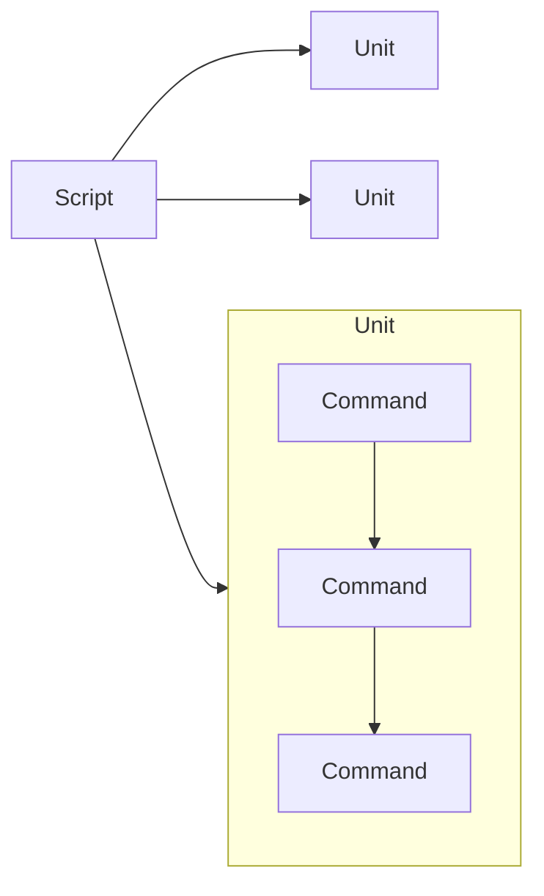
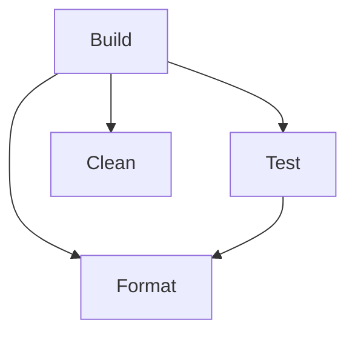
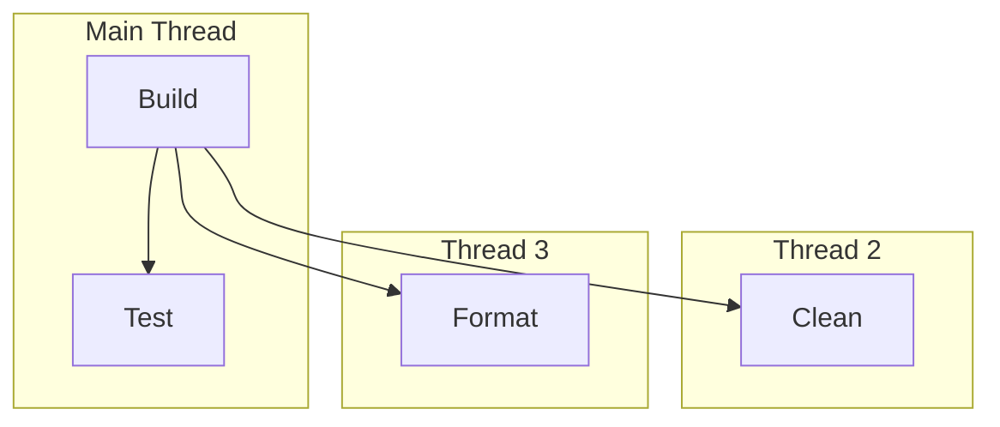
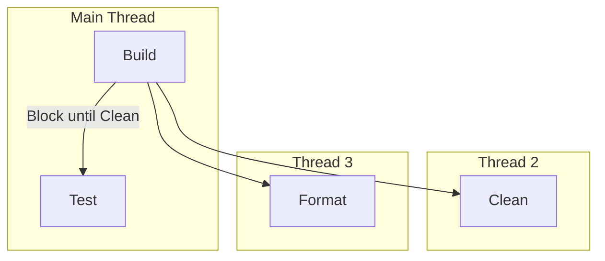
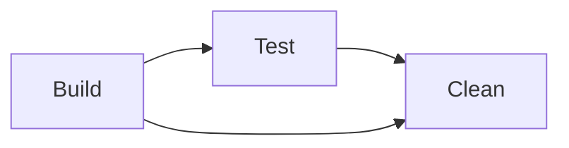
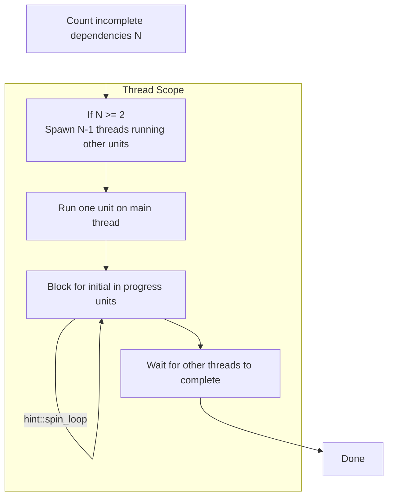

# Implementation

The previous version of the August syntax has a lot of problems.

Using string literals for commands (without an escape system btw) is a crime that is unforgivable.
The previous parse was handwritten and the output system sucked.

This is a document describing the new model, design and syntax for August.

Let's make some breaking changes. :crab:

## Model

August introduces the concept of a **Unit**, removing the distinction between Tasks and Command Definitions.
Units sequentially execute commands which are defined internally.

Some of these commands have special properties like being able to modify the Unit context and call other Units.



## Syntax

```
// Comment
expose Build as build

unit Build {
    meta(
        @name "Build Task"
        @description ""
    )
    
    depends_on(Test)

    do(OtherUnit)

    exec(cargo build --release)
}
```


`depends_on` hoists its tasks and can execute them in any order like `Task task:[test, build]`.


`depends_on` will only run each unit once per execution.
In the above example, Build's could execute its dependencies by completing Format and Clean standalone,
then Test without running Format again.
It could also complete Test first, which would complete Format and then just do Clean.
`do` can run other units, ignores the once property and replaces command definitions.

### Lexing

```rust
enum Token {
    String(String),
    Ident(String),
    RawIdent(String),

    Unit,
    Expose,
    As,

    Attr,
    DoubleColon,
    OpenDelim(Delim),
    CloseDelim(Delim),

    Err(char)
}

enum Delim {
    Round,
    Square,
    Arrow,
    Curly
}
```

### Parsing

Describing the entire formal grammar for August would suck, so here is a few interesting ones.

Exec:
```
exec(cargo "build" --release)
```
Meta:
```
meta(
    @key "Value"
)
```

Commands:
```
FS::create(str)
FS::remove(str)
FS::move(str, str)
FS::copy(str, str)
FS::print_file(str)
FS::eprint_file(str)

ENV::set_var(str, str)
ENV::remove_var(str)
ENV::path_push(str)
ENV::path_remove(str)

IO::println(str)
IO::print(str)
IO::eprintln(str)
IO::eprint(str)

exec() ~()
meta() @()
depends_on()
do() 
```
Module names are case insensitive.

## Runtime

`depends_on` runs its tasks in parallel. So let's define how this works.
If only one task is specified, it will be run on the current thread.
Every other task will be run on a different one.

```
unit Build {
    depends_on(Test, Clean, Format)
}

unit Test {}
unit Clean {}
unit Format {}
```



With connection dependencies.
```
unit Build {
    depends_on(Test, Clean, Format)
}

unit Test {
    depends_on(Clean)
}
unit Clean {}
unit Format {}
```



Every unit is placed in a map to track whether it is in progress or has been completed or not.

In the second example shows a unit that shares a dependency with its dependent.

As Build is the unit being called, it begins work on both Test and Clean at the same time.
Build should not need to concern itself with the dependencies of its dependencies.
Test will run any units that aren't in progress or completed, following the same threading rules.
After all of these complete, Test will block until Clean is completed.

Unlike the original execution model, this model resolves the dependency graph breadth-first,
rather than depth-first.
Thanks to the blocking behaviour, we still can assure that they constraints hold.

Due to the nature of this model, circular dependencies are not allowed and will deadlock.
This can be solved with a verification step for scripts which may be helpful for larger projects.

Codewise, this model should use scoped threads to ensure all threads have completed (read joined),
and all in progress dependencies are resolved. The general algorithm works like so:

