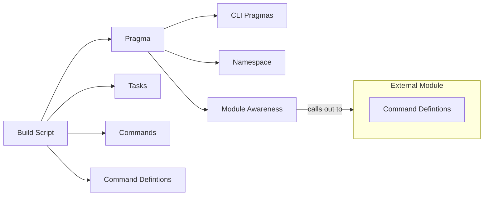

# Structural Hierarchy

```mermaid
flowchart LR
  BS[Build Script]
  P[Pragma]
  PC[CLI Pragmas]
  PN[Namespace]
  PMA[Module Awareness]
  T[Tasks]
  C[Commands]

  BS --> P
  BS --> T
  BS --> C
  BS --> cc[Command Defintions]

  P --> PC
  P --> PN
  P --> PMA

  subgraph EM[External Module]
    CD[Command Defintions]
  end

  PMA -->|calls out to| EM


```
