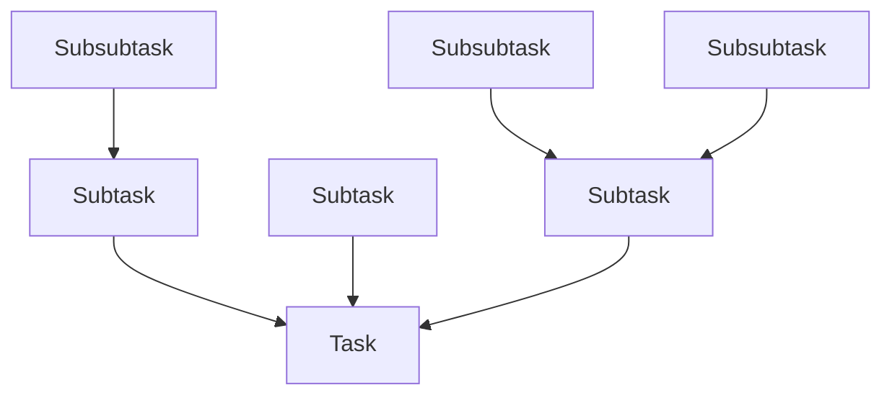

# Introducing August

August's name is derived from the name of a *certain* character, from a *certain* game,
whose name is derived from the name of a *certain* German aircraft carrier.[^1]

It's primary goal is similar to that of other task-based build systems,
to allow for execution of procedural builds where job dependencies exists.

August is written in Rust, a language known for its stability and performance and relies on custom syntax to describe the build process.

[^1]: [For those who are curious...](https://azurlane.koumakan.jp/wiki/August_von_Parseval) 

