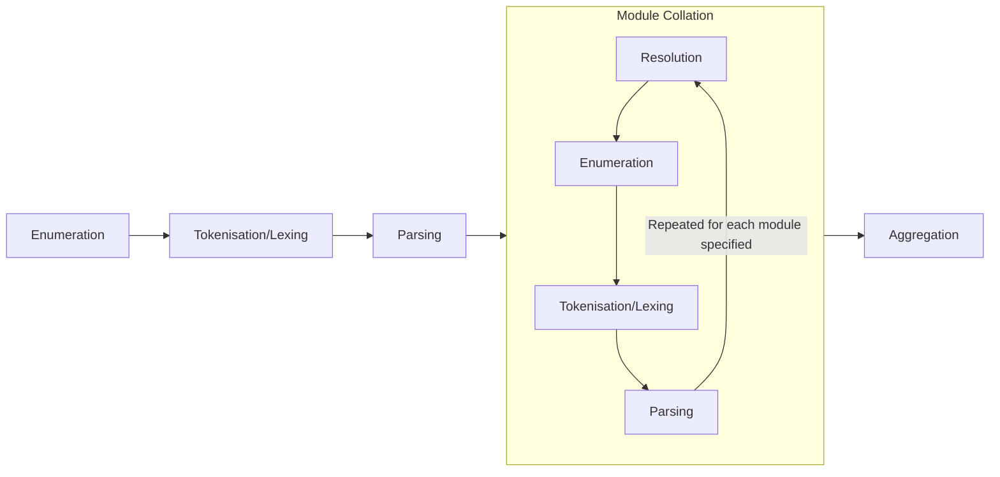

# Process Overview

```mermaid
flowchart LR

E[Enumeration]
T[Tokenisation/Lexing]
P[Parsing]
A[Aggregation]

subgraph M[Module Collation]
  R[Resolution]
  EE[Enumeration]
  TT[Tokenisation/Lexing]
  PP[Parsing]
  
  R --> EE
  EE --> TT
  TT --> PP
  PP -->|Repeated for each module specified| R
end

E --> T
T --> P
P --> M
M --> A

```
